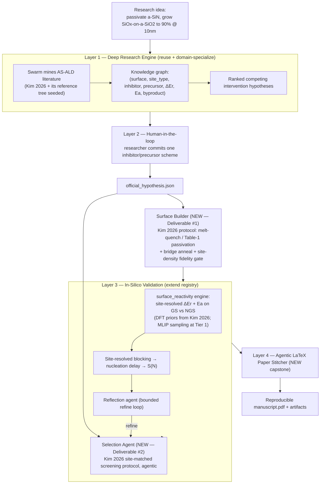

# Architecture & ADR Set — In-Silico AI Co-Scientist for Selective Atomic Layer Growth
### Merck KGaA 2026 Innovation Cup — Challenge 4

**Status:** Proposed · **Owner:** Fallen · **Target:** Passivate SiN, deposit SiOₓ-on-SiOₓ at ≥90 % selectivity at 10 nm oxide (3D-NAND cell isolation)

**Anchor methodology:** Kim, Kim, Hahm, Kwon, Park, Hong & Han, *A computational study for screening high-selectivity inhibitors in area-selective atomic layer deposition on amorphous surfaces*, Appl. Surf. Sci. **730** (2026) 166294, [10.1016/j.apsusc.2026.166294](https://doi.org/10.1016/j.apsusc.2026.166294) — hereafter **Kim 2026**. Every scientific decision below (surface protocol, reactive-site taxonomy, reactivity definitions, screening logic, caveats) is grounded in that paper rather than in generic AS-ALD heuristics.

---

## 0. Orientation

Challenge 4 asks for exactly the artifact this repository already is — an *in-silico AI co-scientist* — applied to **area-selective atomic layer deposition (AS-ALD)**. The two graded deliverables named in the brief are:

1. **An amorphous model surface builder that better reflects experimental surfaces.**
2. **Agentic selection logic for inhibitor/precursor candidates.**

Kim 2026 is, in effect, the *manual* version of what we automate: a DFT screening study that (a) builds experiment-faithful amorphous a-SiO₂ and a-SiNₓ slabs via melt–quench, (b) quantifies inhibitor reactivity **per surface site type** (silanol −OH, siloxane −O−, amine −NH₂, imide −NH−), and (c) closes with a three-step screening protocol for choosing precursor–inhibitor pairs. Our strategic bet: implement that paper's methodology as the validation core of the existing Layer 1→2→3 funnel — the surface builder reproduces its slab protocol and is *gated against its measured site densities*, the reactivity engine computes its Eq. (1)–(2) quantities, and the selection agent executes its screening protocol agentically — then add a capstone **Layer 4** that autonomously stitches a reproducible LaTeX paper. Teams that submit two disconnected Python scripts satisfy the letter of the brief; a closed-loop co-scientist that operationalizes a 2026 *Applied Surface Science* screening methodology end-to-end satisfies its spirit and is far harder to out-engineer.

### 0.1 The funnel

### 0.2 ADR index

| ADR | Layer | Decision | New / Reuse |
|---|---|---|---|
| 000 | — | Select Challenge 4; commit to the co-scientist funnel around Kim 2026 | — |
| 001 | 1 | Domain-specialize the Deep Research Engine; seed Kim 2026 + reference tree | Reuse + adapt |
| 002 | 2 | Keep human-in-the-loop hypothesis commitment | Reuse |
| 003 | Builder | Amorphous surface builder per Kim 2026 slab protocol, gated on measured site densities | **New — Deliverable #1** |
| 004 | 3 | `surface_reactivity` validator: site-resolved ΔEr/Ea (Kim 2026 Eqs. 1–2) | **New engine** |
| 005 | 3 | Agentic selection = Kim 2026 three-step screening protocol as a ReAct designer | **New — Deliverable #2** |
| 006 | 3 | Site-resolved blocking + nucleation-delay scoring against the brief's metric | **New** |
| 007 | 4 | Agentic LaTeX paper stitcher with figure-vision QA | **New capstone** |
| 008 | ⟂ | Provenance, pinned environments, KG linkage for reproducibility | Reuse pattern |
| 009 | 3 | **In-silico testing protocol** (the runnable experiment → paper results) | **New — winning criterion** |

---

## The science, in one screen (per Kim 2026)

AS-ALD works by dosing a molecular **inhibitor** that selectively chemisorbs on the **non-growth surface (NGS)** and blocks the ALD precursor there, while leaving the **growth surface (GS)** reactive. The film nucleates on GS and is delayed on NGS — that delay *is* the selectivity. Kim 2026 shows this is a **site-resolved** problem, not a whole-surface one: an amorphous surface exposes *terminal* sites (silanol −OH on SiO₂; amine −NH₂ on SiNₓ) and *bridge* sites (siloxane −O−; imide −NH−), each with its own reaction pathway, reaction energy, and activation barrier. Two quantities, both defined between the physisorbed and chemisorbed states, capture everything:

- **Reaction energy** ΔEr = E(chemisorption) − E(physisorption) — must be exothermic for a stable, purge-surviving bond. Physisorbed species are removed during the ALD purge step, so only chemisorption passivates.
- **Activation energy** Ea = E‡ − E(physisorption) — the rate-determining barrier of the proton-mediated ligand-exchange step (CI-NEB), which sets whether chemisorption happens on process timescales at process temperature.

Three findings from Kim 2026 dictate our design:

1. **Amorphous ≠ crystalline, and the error is not a constant offset.** Amorphous surfaces show 17–36 % *lower* Ea for inhibitor anchoring than crystalline models — kinetic enhancements of 10²–10⁷× at room temperature. Crystalline-slab DFT predicted aminosilanes inert on Si₃N₄ at 150 °C (Ea ~1 eV… actually observed to adsorb on a-SiNₓ experimentally) and pivalic acid inert on SiO₂ (Ea 1.78 eV… adsorbs readily). A screening tool built on crystalline slabs gets the *sign* of selectivity decisions wrong. This is why the surface builder is the make-or-break component.
2. **Bridge sites decide the precursor–inhibitor match.** DMATMS passivates a-SiO₂ silanols easily (Ea 0.48 ± 0.16 eV, exothermic) but its reaction at siloxane −O− bridges is endothermic (ΔEr 0.64 ± 0.22 eV, Ea 1.50 ± 0.13 eV) — so it blocks BDEAS-class precursors (which react mainly at −OH) but *fails* against TMA/DMAI (which attack bridges). Selection logic must match the inhibitor's passivated-site set to the precursor's preferred-site set.
3. **Head-group chemistry is directional.** The aminosilane DMATMS prefers oxide (−OH); the hydrolyzed chlorosilane ETS prefers nitride (−NH₂: Ea 0.79 ± 0.03 eV; −NH−: Ea 0.80 ± 0.28 eV, both exothermic, NH₃/bridge-cleavage products) while being sluggish on oxide silanols (Ea > 1 eV, marginal exothermicity). For *our* assignment — GS = a-SiO₂, NGS = a-SiNₓ — the paper's own numbers point at **an ETS-class chlorosilane inhibitor on the nitride, with BDEAS growing SiOₓ on the oxide**.

Feed the site-resolved reactivity into a **blocking-coverage / nucleation-delay model** → thickness vs cycle on each surface → the brief's selectivity `S = (Thk_GS − Thk_NGS)/(Thk_GS + Thk_NGS)`, evaluated at 10 nm.

---

## ADR-000 — Challenge selection and overall approach

**Status:** Accepted

**Context.** Four challenges. Our differentiator is a layered agentic in-silico co-scientist; our weakness is deep wet-lab biochemistry judgement. Challenge 1 (fibrosis) and Challenge 3 (ADC linker) are medicinal-/bio-chemistry problems with no clean computational ground truth and expert judges. Challenge 2 (HIC regression) has a crisp metric but uses none of our architecture. Challenge 4 is titled *"in-silico AI co-scientist,"* is inorganic surface chemistry drawn from literature, and is explicitly a Python/agent software task. Crucially, the exact scientific methodology the challenge implies — site-resolved inhibitor screening on realistic amorphous SiO₂/SiNₓ — was published in February 2026 as Kim 2026 (an SNU/Samsung collaboration on precisely the 3D-NAND oxide/nitride system), giving us a peer-reviewed blueprint to automate rather than a methodology to invent.

**Decision.** Build Challenge 4 as the flagship application of the existing funnel, with Kim 2026 as the load-bearing methodological anchor. Layer 1's literature-grounding is precisely what lets us compete in a domain we don't personally know — the system does the domain learning, and the anchor paper supplies the ground-truth numbers (site densities, ΔEr, Ea per site) our engine calibrates against. Reframe "we lack surface-chemistry expertise" from a disqualifier into a Layer-1 sub-problem.

**Consequences.** We must add one validator engine (site-resolved surface reactivity) and one input stage (surface builder). Both are tractable with mainstream atomistic tooling (ASE, pymatgen, rdkit, foundation MLIPs) and far cheaper than inventing a fibrosis or novel-linker validator — and Kim 2026 itself names MLIPs as the intended scale-up path beyond its DFT budget, which is exactly our Tier-1. Layers 1, 2, and the new Layer 4 are largely reuse.

**Alternatives considered.** Challenge 3 was second on architecture fit (RDKit + ODE engines partially apply) but the "design a *novel* linker" bar and expert judging penalize our domain gap. Rejected.

---

## ADR-001 — Layer 1: Deep Research Engine, domain-specialized to surface chemistry

**Status:** Proposed · **Layer:** 1 · **Change:** reuse with a new domain vocabulary + seeded anchor set

**Context.** The existing swarm mines arXiv/OpenAlex/Crossref/PubMed/Semantic Scholar and merges per-domain hypothesis state graphs into a ranked knowledge graph. AS-ALD's core literature sits in ACS/AIP/Elsevier journals rather than arXiv, but the concepts, entities, and DFT numbers we need are well indexed by OpenAlex/Crossref/Semantic Scholar by DOI — and Kim 2026's ~80-entry reference list is a curated map of the field (Parsons & Clark review; Mackus selectivity; Mameli & Teplyakov SMI selection criteria; the DMATMS line of Soethoudt/Delabie; Zhuravlev silanol chemistry; the amorphous-slab modeling literature).

**Decision.** Add surface-chemistry research agents whose extraction schema populates the KG with typed, *site-resolved* nodes: `Surface{material, phase, site_type, site_density}`, `Inhibitor{name, head_group, tail_group, vapor_pressure, removability}`, `Precursor{name, target_film, preferred_sites}`, `Mechanism{site_type, pathway, ΔEr, Ea, byproduct}`, `SelectivityResult{film, thickness, %selectivity, method}`. The `site_type` and `byproduct` fields are new relative to a generic chemistry schema and come straight from Kim 2026's analysis (proton-mediated ligand exchange; volatile HNR₂/NH₃/H₂O byproducts; bridge-cleavage vs proton-transfer pathways). Always inject a hand-curated seed of anchor citations with real DOIs (`sources/seed_asald.py`) — Kim 2026 first, plus its key antecedents — so no run is ever left without domain-grounded literature. Hypotheses are generated as concrete *intervention* statements, e.g. *"A hydrolyzed chlorosilane SMI (ETS-class) selectively passivates a-SiNₓ −NH₂/−NH− sites, enabling BDEAS-based SiOₓ growth on a-SiO₂ to ≥90 % selectivity at 10 nm."*

**Consequences.** The KG doubles as (a) the hypothesis source for Layer 2, (b) the candidate library **and per-site reactivity prior store** for the Selection Agent (ADR-005) and the Tier-0 engine (ADR-004), and (c) the real-DOI citation store for Layer 4 (ADR-007). One graph, three consumers.

**Alternatives considered.** A hand-curated candidate list. Rejected — it discards the auditable literature provenance that makes the co-scientist credible and reproducible. (The seeded anchors are a floor, not a substitute: mined literature merges on top and can override.)

---

## ADR-002 — Layer 2: Human-in-the-loop hypothesis commitment

**Status:** Proposed · **Layer:** 2 · **Change:** reuse as-is

**Context.** The LangGraph `interrupt` presents the top-5 hypotheses; the researcher selects/modifies/merges/redirects; the decision is saved as `official_hypothesis.json`.

**Decision.** Keep unchanged. In a materials setting the human step maps cleanly onto "which inhibitor/precursor scheme do we commit compute to," which is exactly the expensive branch point — Kim 2026 itself notes that inhibitor development "continues to depend heavily on labor-intensive trial-and-error," and a human gate before the validation spend is the correct antidote, not a limitation. This mirrors the human-oversight pattern used by closed-loop materials agents (e.g. MAPPS, MatAgent).

**Consequences.** No engineering change. The committed hypothesis fixes GS/NGS materials, target film, thickness, and selectivity threshold that flow into Builder, Selection Agent, and the scoring model, carried as a structured `ASALDSpec`.

---

## ADR-003 — Amorphous Surface Builder *(Deliverable #1 — highest leverage)*

**Status:** Proposed · **Stage:** feeds Layer 3 · **Change:** new module `surfaces/amorphous_builder.py` (+ `crystal_slabs.py`, `fidelity_gate.py`, `descriptors.py`)

**Context.** The brief's central warning — that computed selectivity is dominated by the assumed amorphous surface model — is Kim 2026's central *finding*. Crystalline-slab DFT predicted aminosilanes unreactive on nitride at 150 °C and pivalic acid unreactive on silica, both contradicted by experiment; the discrepancy traces to the amorphous surface's disordered reactive-site distribution, exposed bridge sites, lower atomic density, and varied hydrogen bonding. Kim 2026 also supplies the quantitative targets a builder must hit for PECVD-grown films: **a-SiO₂** silanol −OH 6.19 ± 0.51 nm⁻² (vicinal 4.82 ± 0.88, isolated 1.37 ± 0.51; ~4.5 nm⁻² experimental near 500 K), siloxane −O− 3.86 ± 1.28 nm⁻²; **a-SiNₓ** amine −NH₂ 3.91 ± 1.06 nm⁻², imide −NH− 3.53 ± 0.88 nm⁻² (plus −OH/−O− from oxygen impurities); crystalline references c-SiO₂ 9.57 OH/nm² and c-Si₃N₄ 5.97 NH₂/nm². Amorphous surfaces carry ~35 % *fewer* terminal sites than crystalline — so a builder that over-counts sites (the failure mode the brief warns about) also mis-prices every downstream reactivity number. **This is where the challenge is won or lost.**

**Decision.** Implement the builder as a faithful automation of Kim 2026's slab protocol, with an explicit *per-site-type density target* and a *structural-fidelity gate*:

1. **Seed** bulk from a crystalline precursor at the experimental PECVD density and stoichiometry: α-SiO₂ 3×3×2 at 2.2 g/cm³, Si:O = 1:2; β-Si₃N₄ 2×2×3 at 2.6 g/cm³, Si:N = 9:11 — with a fraction of N substituted by O to reach Si:N:O = 9:10:1, capturing the SiON character of fab-exposed nitride (final bulks Si₅₄O₁₀₈ and Si₇₂O₈N₈₀).
2. **Melt–quench** (reference path, `SLAB_SOURCE=aimd`, Phase 3): pre-melt 6000 K/10 ps (SiO₂) or 5000 K/10 ps (Si₃N₄), melt at 3000 K/4000 K for 10 ps, quench to 0 K over 15 ps, relax; remove any N₂ evolved during melting; validate the bulk RDF against experiment. The **default path** (`SLAB_SOURCE=procedural`, Phase 1) substitutes a crystalline-derived cleaved slab — same passivation and gating — because AIMD-class calculators are out of hackathon budget; the approximation is declared in provenance, and Kim 2026's per-site DFT numbers ground the reactivity either way.
3. **Cleave** along z with 15 Å vacuum (random planes for SiO₂; near oxygen atoms for SiNₓ so impurity-oxygen surface groups are represented); two terminations per bulk → ensemble members.
4. **Saturate** dangling bonds per Kim 2026 Table 1, keyed on element and dangling-bond count: Si³⁺→Si(OH)₂H, Si²⁺→Si(OH)H, Si¹⁺→SiOH, O¹⁺→OH on oxide; Si³⁺→Si(NH)H, Si²⁺→Si=NH, Si¹⁺→SiNH₂, N²⁺→NH₂, N¹⁺→NH, O¹⁺→OH on nitride. The =NH and −H termini are included deliberately: they are the feedstock for bridge formation.
5. **Bridge anneal** — 1000 K/5 ps then quench (geometric analogue on the procedural path): Si=NH rearranges into bridging Si−NH−Si imide, released H caps nearby dangling bonds, siloxane −O− bridges form. This is what puts *reactive bridge sites* — the sites that decide precursor–inhibitor matching (see ADR-005) — on the surface at realistic densities. Si−H survivors are counted but ignored for reactivity (< 1 nm⁻², per the paper).
6. **Fidelity gate** — classify every surface site (terminal vs bridge, isolated vs vicinal silanol) and **reject any slab whose per-site-type densities fall outside the Kim 2026 bands** (a-SiO₂ −OH ~4.5–7.5 nm⁻², −O− ~2.0–6.0 nm⁻²; a-SiNₓ −NH₂ ~2.5–5.5 nm⁻², −NH− ~2.0–5.5 nm⁻²), alongside RDF/coordination and roughness descriptor checks. Emit `surface_fidelity.json` with the crystalline references (9.57 / 5.97 nm⁻²) recorded for contrast.
7. **Ensemble** — generate *N* independent surfaces per condition (Kim 2026 uses six per material; we default to five per side, seed-controlled), because selectivity is model-sensitive; downstream reactivity is reported as a distribution over the ensemble, mirroring the paper's mean ± std convention.

**Consequences.** This single decision is our scientific credibility. It directly answers "better reflects experimental surfaces" with a protocol and acceptance bands taken from a peer-reviewed study of the *exact* material pair in the brief; the gate throws out pathological surfaces before expensive reactivity calls (reducing wasted compute); and the ensemble converts a fragile point estimate into an error-barred result — the thing a domain judge looks for.

**Alternatives considered.** (a) A raw melt-quench slab with no site-density control — rejected, reproduces exactly the artifact the brief warns against. (b) The previous design's classical-MD (BKS/LAMMPS) route with a condensation sweep to the Zhuravlev band (~0.35–2.0 OH/nm²) — **superseded**: that band describes thermally dehydroxylated fumed silica, not PECVD films; Kim 2026's measured 6.19 ± 0.51 nm⁻² (with the ~4.5 nm⁻² 500 K experimental anchor) is the right target for the 3D-NAND context, and the paper's Table-1 passivation + anneal replaces the ad-hoc OH-condensation sweep. (c) Full DFT relaxation of every slab — rejected on cost; we relax with an MLIP and reserve xTB/DFT spot-checks for the gate. **Packages:** ASE, pymatgen, rdkit; OVITO/pyscal-class descriptors.

---

## ADR-004 — Layer 3: `surface_reactivity` validation engine

**Status:** Proposed · **Layer:** 3 · **Change:** new engine in `validation/`, new registry route

**Context.** Layer 3 already runs a Supervisor + specialist-validator swarm with a ReAct designer and a Reflection loop (per the Seal et al. agentic architecture the repo cites). We need a materials engine analogous to the existing `cheminformatics`/`mechanistic` validators. Kim 2026 defines the physics precisely — and, in its Discussion, explicitly designates MLIPs as the way to scale its DFT protocol to "extensive sampling of complex amorphous environments at substantially reduced computational cost." That sentence is this engine's mandate.

**Decision.** Add `validation/surface_reactivity.py`, registered under keywords `passivate | selective deposition | ALD | inhibitor | nitride | oxide`. For each `(inhibitor, precursor, GS, NGS)` candidate over the surface ensemble it computes, **per site type** (−OH, −O−, −NH₂, −NH−), the two Kim 2026 quantities:

- **Reaction energy** `ΔEr = E_chemisorption − E_physisorption` (Eq. 1) — the chemisorbed state includes the byproduct physisorbed nearby; the physisorbed state is the hydrogen-bonded pre-complex. Exothermic ΔEr is the necessary condition for a purge-surviving passivating bond.
- **Activation energy** `Ea = E‡ − E_physisorption` (Eq. 2) — the rate-determining barrier of the proton-mediated ligand exchange (CI-NEB with pre-relaxed endpoints; for multi-barrier pathways, the highest sub-barrier). At bridge sites the engine evaluates the competing pathways (bridge-cleavage vs proton transfer) and keeps the thermodynamically favored one, as the paper does.

Reactivity at a site then requires **both** exothermic ΔEr **and** Arrhenius-feasible kinetics over the dose time at process temperature (150 °C default) — matching the paper's two key criteria for an ideal inhibitor: inert on the GS, and *complete* passivation of the precursor-relevant sites on the NGS.

**Compute tiers.**
- **Tier 0 (default, laptop):** no atomistic calculation — per-site ΔEr/Ea priors mined from the literature into the KG, with Kim 2026's DFT values seeded for DMATMS and ETS on every site type (e.g. DMATMS/a-SiO₂ −OH: Ea 0.48 ± 0.16 eV exothermic, −O−: ΔEr +0.64, Ea 1.50 eV; ETS/a-SiNₓ −NH₂: Ea 0.79 ± 0.03 eV, −NH−: Ea 0.80 ± 0.28 eV; carboxylic acids keep terminal-site adsorption-ΔE priors from the Adv. Mater. 2023 spatial-ALD line).
- **Tier 1 (Colab GPU/CPU):** real molecules (rdkit ETKDGv3 + MMFF) on gated slabs; multi-site × orientation × height adsorption search under a foundation MLIP; `reaction_energetics` builds the physisorption and chemisorption *endpoints* and returns ΔEr per Eq. (1). NEB Ea is opt-in (`COMPUTE_ACTIVATION_ENERGY=true`) and otherwise defaults to the mined priors.
- **Tier 2 (optional):** GFN2-xTB (tblite/ASE) recomputes a subset of configurations as a cross-check; a large MLIP-vs-xTB gap flags calibration for review.

**Engine choice and calibration.** Default MLIP: **MACE-MP** (`mace_mp(model="medium", dispersion=True, default_dtype="float64")`) — ungated and pip-installable; dispersion is mandatory since Kim 2026's physisorption states are vdW-bound (the paper uses DFT-D3(BJ)). **Critical calibration:** foundation MLIPs systematically *underestimate reaction barriers*, so Ea from Tier 1 is always labeled a lower bound, and every ΔEr is **anchored to the Kim 2026 DFT numbers** with the predicted-vs-literature delta carried as an explicit `validity_flag` — never hidden. The paper's own caveats propagate as engine caveats: energies are 0 K internal energies; entropic shifts reach ~0.25 eV at 150 °C (relative trends preserved); byproduct secondary reactions are not modeled; chlorosilanes are modeled in hydrolyzed form (ETS hydrolyzes on chamber humidity). Two reproducibility footguns: (1) `mace_mp()` and `MACECalculator()` can return energies differing by orders of magnitude — pick one loader and never mix; (2) foundation-model energies are only meaningful as **differences within one calculator + fixed dispersion/dtype**, so slab, gas-phase molecule, physisorbed and chemisorbed complexes all use identical settings.

**Consequences.** Slots into the existing designer→validator→reflection loop with no framework change — it is "just another engine" in the registry, which is the whole point of the pluggable design. The site-resolved ΔEr/Ea formulation (rather than a single whole-surface adsorption ΔE) is what lets ADR-005's site-matching logic work at all, and the calibration-and-flag discipline is what separates a credible in-silico result from a number generator.

**Alternatives considered.** (a) Full DFT (VASP/CP2K) throughout — rejected: infeasible in a hackathon; Kim 2026 already concedes DFT cost blocks exhaustive amorphous sampling and points to MLIPs. (b) Adsorption-energy-only screening (the previous design) — **superseded**: it cannot distinguish DMATMS-vs-TMA-class behavior at bridge sites, which Kim 2026 shows is the actual selection-relevant contrast; retained only as the legacy terminal-site path for carboxylic-acid candidates without site-resolved priors. (c) Pure descriptor/ML regressor with no physics — rejected: no mechanistic story to defend, no transferability to the "others welcome" film chemistries (ZrO₂/TiO₂/HfO₂).

---

## ADR-005 — Agentic inhibitor/precursor selection *(Deliverable #2)*

**Status:** Proposed · **Layer:** 3 (designer) · **Change:** specialize the ReAct experiment designer

**Context.** The brief asks for "agentic selection logic for inhibitor/precursor candidates" and notes a markdown file may supply selection criteria. Kim 2026 closes with exactly the screening protocol such an agent should execute: *(1) identify all potential reactive sites on the NGS, including terminal and bridge sites; (2) evaluate their specific reactivity toward the target precursor and inhibitor candidates; (3) select inhibitor molecules that effectively passivate those sites where the precursor exhibits favorable adsorption.* Its worked contrast is the design lesson: DMATMS is a good inhibitor against BDEAS-class precursors (both act at −OH) but a *wrong* choice against TMA/DMAI (which adsorb at −O− bridges DMATMS cannot passivate); ETS, reactive across the nitride's site inventory, is the natural nitride passivant. Agentic-materials work adds two more lessons: swarm exploration beats a single agent, and agents must be *nudged to persist* past low-information local minima.

**Decision.** Implement the selection logic as the ReAct designer specialized for AS-ALD, executing Kim 2026's protocol agentically, driven by a human-editable `selection_criteria.md`. Flow:

1. **Retrieve** candidate inhibitors/precursors from the Layer-1 KG (literature-grounded: **DMATMS** and aminosilanes; **ETS** and short-chain chlorosilanes; hacac; aldehydes and cyclic azasilanes for nitride; carboxylic acids — acetic/pivalic/ethylbutyric; methanesulfonic acid; aniline & N-aromatics; phosphonic acids · precursors — BDEAS/DIPAS/HCDS for SiOₓ, TDMAT for TiN, DMAI/TMA for Al₂O₃, plus ZrO₂/TiO₂/HfO₂ precursors for the "others welcome" extensions).
2. **Site-match** (the Kim 2026 step): read the NGS site inventory off the gated surface ensemble (ADR-003); look up the precursor's preferred reactive sites (e.g. BDEAS → −OH; TMA/DMAI → −OH *and* −O−); score each inhibitor by how completely its exothermic-and-kinetically-open site reactivity covers the precursor's preferred sites on the NGS **while staying inert on the GS**.
3. **Rank** the site-match score together with the classical criteria in `selection_criteria.md` (differential adsorption, vapor pressure/volatility, head-group ↔ site compatibility, steric blocking by the tail group, post-deposition removability — the Mameli & Teplyakov axes); propose top pairs with justification. Optionally a **novel-compound proposer** injects generative SMILES candidates tagged `ai-proposed`, which can never be verdict-`supported` on priors alone — they must clear the Tier-1 search on real slabs.
4. **Validate** each via ADR-004 over the surface ensemble.
5. **Reflect & refine** — reuse the existing Reflection agent and `MAX_VALIDATION_ITERS` bound to walk down the ranked list if selectivity misses target; adopt swarm-style parallel exploration with a supervisor merge to counter path-dependence.

**Consequences.** Deliverable #2 is satisfied *and* is a faithful agentic implementation of a published screening protocol — proposals are tested rather than asserted, and the site-matching step means the agent can articulate *why* a pair works ("ETS passivates −NH₂ and −NH−, the sites BDEAS would nucleate on; DMATMS would be wrong here because…") rather than emitting a ranking. The `selection_criteria.md` interface is exactly the supplemental-criteria hook the brief mentions, and keeps a human able to steer chemistry priors.

**Alternatives considered.** A static ranked list or a pure LLM guess with no validation feedback — rejected: no closed loop, no defensibility, and prone to the "stopped too soon" failure mode documented for un-nudged agents. Ranking on adsorption strength alone — rejected: Kim 2026's DMATMS/TMA contrast shows it selects wrong pairs.

---

## ADR-006 — Selectivity and nucleation-delay scoring

**Status:** Proposed · **Layer:** 3 (verdict) · **Change:** new scorer `validation/selectivity_model.py`

**Context.** The brief defines the metric — `S = (Thk_GS − Thk_NGS)/(Thk_GS + Thk_NGS)` — with a worked example at 78 % @ 16 Å and a target of **90 % @ 10 nm** oxide. Selectivity in practice is a *nucleation-delay* phenomenon measured in cycles, and Kim 2026 establishes that the blocking behind that delay is site-composition-weighted, not uniform.

**Decision.** Translate site-resolved reactivity into a growth model. **Blocking coverage** on each surface = Σ over site types of (site fraction from the fidelity report × reactivity indicator), where reactivity requires exothermic ΔEr **and** (when Ea is known) an Arrhenius-feasible rate over `DOSE_TIME_S` at process temperature; only chemisorbed, purge-surviving inhibitor counts (Kim 2026's purge argument — physisorbed molecules desorb and do not block). Optionally cap coverage at the random-sequential-adsorption jamming limit for the inhibitor's steric footprint so bulky molecules cannot reach an unphysical full monolayer. The **differential blocking** `θ_block(NGS) − θ_block(GS)` — *not* raw Langmuir coverage, which saturates at ALD temperature and falsely washes out selectivity — maps to a **nucleation delay in cycles**; propagate growth-per-cycle over N cycles (with a small residual defect-nucleation term so NGS growth is never exactly zero) to get `Thk_GS(N)` and `Thk_NGS(N)`; compute `S(N)`; locate the cycle where `Thk_GS = 10 nm` and report `S` there against the 90 % threshold. Reuse the existing Layer-3 verdict schema (**supported / partially supported / rejected**) and surface the per-surface-ensemble distribution (mean ± spread), not a single number. Carboxylic-acid candidates without site-resolved priors fall back to the legacy terminal-site blocking curve, so the previously verified funnel is preserved.

**Consequences.** Produces the exact quantity the brief scores, framed the way practitioners think about it (delay-in-cycles), with uncertainty — the credible form of an in-silico claim — and with the blocking term inheriting Kim 2026's site-resolved physics rather than a whole-surface Langmuir guess.

---

## ADR-007 — Layer 4: Agentic LaTeX Paper Stitcher *(capstone)*

**Status:** Proposed · **Layer:** 4 (new) · **Change:** new subsystem `layer4_paper/`

**Context.** State-of-the-art autonomous-science systems close with an authoring stage: The AI Scientist writes the entire paper in LaTeX with vision-model feedback on figures and an automated reviewer; PaperOrchestra assembles submission-ready LaTeX manuscripts from raw materials; SparksMatter runs ideation→planning→experimentation→**reporting**. We already have a proven LaTeX toolchain, so the capstone is mostly orchestration.

**Decision.** Build an agentic stitcher: per-section writer agents (Abstract · Introduction/Background · Methods = surface-builder protocol + engine parameters · Results = selectivity plots and site-resolved reactivity tables · Discussion · Conclusion · References) feeding a **compiler agent** that fills a LaTeX template and builds via `tectonic`/`latexmk`. Hard rules:

- **No invented results** — every number and figure is pulled from Layer-1→3 artifacts (`asald_results.json`, `validation_results.json`, `surface_fidelity.json`, `simulation_logs/`).
- **Real citations** — bibliography drawn from Layer-1's `citation_repository.json` (actual DOIs, Kim 2026 and its reference tree included), not model-generated references.
- **Figure QA** — a vision-model pass checks each rendered figure for legibility/correctness (the AI-Scientist pattern).
- **Optional internal review** — an automated-reviewer agent scores the draft against the challenge's submission expectations before finalizing.

The Methods section explicitly reproduces the Kim 2026 lineage: slab protocol and Table-1 passivation, ΔEr/Ea definitions (Eqs. 1–2), the site-matched screening protocol, and the paper's stated caveats (0 K energetics, entropy up to ~0.25 eV at 150 °C, byproducts, hydrolyzed ETS) — so a domain reviewer recognizes the methodology instantly.

**Consequences.** Turns the pipeline into an end-to-end co-scientist and produces the *submission artifact itself*. This is the visible differentiator versus teams that hand in scripts + a slide.

**Alternatives considered.** Manual write-up — rejected: it breaks the "co-scientist that authors its own findings" thesis and forgoes reproducibility of the reporting step.

---

## ADR-008 — Reproducibility, provenance, and KG linkage (cross-cutting)

**Status:** Proposed · **Scope:** all layers · **Change:** reuse existing provenance store

**Context.** The brief requires reproducibility. Atomistic results hinge on hidden knobs (random seeds, MLIP model + weights hash, slab source and supercell, passivation scheme, temperature, dose time, cell size).

**Decision.** Pin and log everything: RNG seeds, compute tier, MLIP model/device/dtype/dispersion, slab source (`procedural` vs `aimd`) with Miller index/supercell/capping/bridge counts, process temperature and dose parameters, ensemble size, and package versions — written to `research_provenance.json` / `validation_provenance.json` / `asald_results.json` / `surface_fidelity.json` / `simulation_logs/`. Ship a `Dockerfile` + locked `environment.yml` reproducing the Tier-0 funnel end-to-end. Link results back into the KG as `surface_model:*` and `validation_result:*` nodes joined by `evidence_for` edges — so the final paper's every claim resolves to a logged computation, and every prior resolves to a DOI (Kim 2026's per-site numbers carry their source id through the whole chain).

**Consequences.** Satisfies the reproducibility requirement concretely (a judge can re-run and recover the numbers) and makes the KG the single source of truth binding literature → hypothesis → surface → site-resolved reactivity → selectivity → manuscript.

---

## ADR-009 — In-Silico Testing Protocol *(the winning criterion)*

**Status:** Proposed · **Layer:** 3 · **Change:** formalize the experiment the designer runs; engine `validation/surface_reactivity.py`

**Context.** "In-silico testing" is a graded requirement, and the paper must report a **hypothesis that was tested** plus **computed results**, not a narrative. Kim 2026 gives the test its precise, site-resolved definition: the selectivity claim is validated by computing, on experiment-faithful amorphous surfaces, the **differential site-resolved reactivity** between GS and NGS. Full DFT-accuracy everywhere is infeasible in a hackathon and foundation-MLIP barriers are unreliable, so the protocol is **tiered by compute** and anchored on the paper's DFT ΔEr/Ea values, with MLIP endpoints (which foundation models predict well) as the Tier-1 upgrade and NEB barriers demoted to an explicitly-labeled option.

**Decision — the protocol.** For the committed hypothesis, run these five steps and record every intermediate to `asald_results.json`:

1. **Build & gate surfaces (Deliverable #1).** Generate an *ensemble* of N a-SiO₂ (GS) and N a-SiNₓ (NGS) slabs per ADR-003; pass each through the `SurfaceFidelityGate` (per-site-type densities inside the Kim 2026 bands); discard failures. This *reduces* wasted compute and is the credibility anchor.
2. **Site-resolved inhibitor reactivity screen.** For each gated surface and the candidate inhibitor, evaluate ΔEr (and Ea where available) at every reactive site type — Tier 0 from KG-mined/seeded Kim 2026 priors, Tier 1 from MLIP physisorption/chemisorption endpoints on the real slab. Expected signature for the ETS-class flagship: exothermic, kinetically open chemisorption on a-SiNₓ (−NH₂ Ea ≈ 0.79 eV, −NH− Ea ≈ 0.80 eV) vs sluggish, marginally exothermic reaction on a-SiO₂ −OH (Ea > 1 eV).
3. **Effective blocking coverage.** Convert per-site reactivity to blocking = Σ (site fraction × reactivity), counting *only chemisorbed, purge-surviving* inhibitor; optionally cap at the RSA jamming limit for the inhibitor footprint. The **differential blocking** `θ_block(NGS) − θ_block(GS)` is the selectivity driver — *not* raw Langmuir coverage, which saturates at ALD temperature and would falsely wash out selectivity (a mistake caught during reference-implementation testing). Check the site-match: the blocked NGS sites must cover the precursor's preferred sites (BDEAS → −OH; bridge-attacking precursors additionally require −O−/−NH− passivation).
4. **[Tier-1/2, optional] Precursor barrier.** NEB for the precursor's first half-reaction on clean-GS vs inhibited-NGS (`COMPUTE_ACTIVATION_ENERGY=true`). Report as a **lower bound** with an explicit note that foundation MLIPs underestimate barriers; calibrate against Kim 2026's DFT values before trusting anything absolute.
5. **Selectivity & verdict.** Map differential blocking → nucleation delay (cycles) → `Thk_GS(N)`, `Thk_NGS(N)` (with a small residual defect-nucleation term so NGS growth is never exactly zero) → `S(N) = (Thk_GS − Thk_NGS)/(Thk_GS + Thk_NGS)`. Report `S` at the cycle where `Thk_GS = 10 nm`, as **mean ± std over the surface ensemble**, and emit a verdict (supported / partially supported / rejected). Calibrate the predicted energetics against the Kim 2026/xTB anchor and carry the delta as a `validity_flag`; inherit the paper's caveats (0 K energetics, ~0.25 eV entropic shift at 150 °C) as recorded flags, not footnotes.

The reference implementation's verified worked example (carboxylic-acid SMI on a-SiN via the legacy terminal-site path, BDEAS on a-SiO₂) produces differential blocking ≈ 0.94 and **S ≈ 0.92 at 10 nm → "supported"**, with selectivity realistically degrading past breakthrough (≈0.77 at 12 nm) — the correct qualitative shape for area-selective growth. The Kim 2026-grounded flagship run swaps in ETS with full site-resolved blocking on both site inventories.

**Consequences.** The graded in-silico test is a single, reproducible command that emits the exact quantity the brief scores, with uncertainty and a literature calibration flag, computed by the same site-resolved logic a 2026 peer-reviewed screening study uses. Every number in the paper traces to this JSON.

**Alternatives considered.** Barrier-centric validation (NEB as the primary discriminator) — rejected as the default: fragile and systematically biased for foundation MLIPs; demoted to an optional refinement, with Kim 2026's DFT Ea values used as priors instead. Single-surface (non-ensemble) testing — rejected: the brief's warning and Kim 2026's crystalline-vs-amorphous findings both say a point estimate is indefensible. Whole-surface Langmuir blocking — rejected: washes out selectivity at process temperature and ignores the bridge-site physics that decides pair compatibility.

### Results → Paper mapping (what Layer 4 pulls, and from where)

| Paper element | Source field in `asald_results.json` | Notes |
|---|---|---|
| **Hypothesis** (verbatim) | `hypothesis.statement` + GS/NGS/inhibitor/precursor/target | The Layer-2 committed `ASALDSpec`; provenance DOIs from Layer-1 KG |
| **Methods — surfaces** | `surface_ensemble.fidelity_reports` | Table: per-site-type densities vs Kim 2026 bands (+ crystalline references); gate pass/fail |
| **Methods — engine** | `provenance` (tier, MLIP name/device, temperature, dose, seeds) | Reproducibility; states the barrier caveat and 0 K/entropy caveats |
| **Table 1 — site-resolved reactivity** | `inhibitor_adsorption.site_resolved` (per-site ΔEr/Ea, blocking) | The chemisorb-on-NGS / inert-on-GS evidence, per site type |
| **Table 2 — barrier** (optional) | `precursor_barrier` | Labeled lower-bound |
| **Figure 1 — selectivity** | `selectivity.curve` | S vs thickness/cycle with 90 %@10 nm target line + ensemble band |
| **Table 3 — calibration** | `calibration_vs_literature` | Predicted-vs-Kim-2026/xTB delta + validity flag (rigor signal) |
| **Result / Verdict** | `selectivity.S_at_target_mean ± std`, `verdict` | The headline claim |

**Hypothesis section, concretely.** The paper's hypothesis is the committed intervention statement, e.g. *"A hydrolyzed chlorosilane small-molecule inhibitor (ETS-class) selectively passivates a-SiNₓ −NH₂ and −NH− sites, enabling BDEAS-based SiOₓ growth on a-SiO₂ to ≥90 % selectivity at 10 nm oxide thickness"* — carried as a structured object (GS, NGS, inhibitor, precursor, target thickness, target selectivity, provenance DOIs) so the same record seeds the test, the results, and the manuscript.

---

## Where the win comes from

1. **Both graded deliverables are first-class** — the surface builder (ADR-003) and the selection agent (ADR-005) are the two things judges are told to look for, and ours implement (and cite) a February-2026 peer-reviewed methodology for the exact SiO₂/SiNₓ 3D-NAND system rather than a one-shot heuristic.
2. **We turn the stated risk into our moat** — the brief warns that surface-model fidelity dominates results; Kim 2026 *proves* it (17–36 % Ea reductions, sign-flipping screening errors from crystalline slabs), and ADR-003 makes that the centerpiece (per-site-type density gate + ensembles + uncertainty).
3. **The domain gap is dissolved by Layer 1** — literature grounding means the system, not us, supplies the surface chemistry, and the anchor paper supplies calibration ground truth for every site type.
4. **The capstone is the submission** — Layer 4 authors the reproducible paper the challenge asks for, end-to-end.

## References (arXiv / DOI)

- **Kim et al., *A computational study for screening high-selectivity inhibitors in area-selective atomic layer deposition on amorphous surfaces*, Appl. Surf. Sci. 730 (2026) 166294, 10.1016/j.apsusc.2026.166294 — the anchor: melt-quench amorphous a-SiO₂/a-SiNₓ slab protocol + Table-1 passivation, measured site densities (−OH 6.19 ± 0.51, −O− 3.86 ± 1.28, −NH₂ 3.91 ± 1.06, −NH− 3.53 ± 0.88 nm⁻²), site-resolved ΔEr/Ea for DMATMS and ETS, and the three-step site-matched screening protocol.**
- Parsons & Clark, *Area-selective deposition: fundamentals, applications, and future outlook*, Chem. Mater. 2020, 10.1021/acs.chemmater.0c00722 — the field's anchor review (Kim 2026 ref. [6]).
- Mameli & Teplyakov, *Selection criteria for small-molecule inhibitors in area-selective ALD*, Acc. Chem. Res. 2023, 10.1021/acs.accounts.3c00221 — the classical selection axes behind `selection_criteria.md` (Kim 2026 ref. [11]).
- Soethoudt et al., *Insight into selective surface reactions of dimethylamino-trimethylsilane for area-selective deposition*, J. Phys. Chem. C 2020, 10.1021/acs.jpcc.9b11270 — DMATMS site chemistry (Kim 2026 ref. [17]).
- Merkx et al., *Relation between reactive surface sites and precursor choice for AS-ALD using small molecule inhibitors*, J. Phys. Chem. C 2022, 10.1021/acs.jpcc.1c10816 — precursor ↔ site preference, the site-matching premise (Kim 2026 ref. [22]).
- Tezsevin et al., *Computational investigation of precursor blocking … aniline SMI*, Langmuir 2023, 10.1021/acs.langmuir.2c03214 — chemisorb-vs-physisorb selectivity, RSA coverage (Kim 2026 ref. [40]).
- Karasulu, Roozeboom & Mameli, *High-throughput area-selective spatial ALD of SiO₂ with interleaved small-molecule inhibitors*, Adv. Mater. 2023, 10.1002/adma.202301204 — carboxylic-acid SMI priors for the legacy path (Kim 2026 ref. [25]).
- Roh et al., *Surface reactions in ALD of silicon oxide using BDEAS and ozone*, Appl. Surf. Sci. 2022, 10.1016/j.apsusc.2021.151231 — BDEAS reacts predominantly at −OH sites (Kim 2026 ref. [39]).
- Zhuravlev, *The surface chemistry of amorphous silica*, Colloids Surf. A 2000, 10.1016/s0927-7757(00)00556-2 — silanol-density reference frame (Kim 2026 ref. [77]).
- Ewing et al., *Accurate amorphous silica surface models from first-principles thermodynamics of surface dehydroxylation*, Langmuir 2014, 10.1021/la500422p — free-energy silanol densities the builder's a-SiO₂ gate cross-checks (Kim 2026 ref. [71]).
- *MAD-SURF*, arXiv:2601.18852 — fine-tuning MACE-MPA-0 for molecular adsorption on surfaces (Tier-1 engine basis).
- *Fine-tuning foundation MLIPs with frozen transfer learning*, arXiv:2502.15582 — foundation MLIPs underestimate reaction barriers (the Ea lower-bound rule).
- Werbrouck et al., *LLM Agents for Knowledge Discovery in Atomic Layer Processing*, arXiv:2509.26201 — agent/swarm exploration, path-dependence, persistence.
- Ghafarollahi & Buehler, *SparksMatter*, arXiv:2508.02956 — ideation→planning→experimentation→reporting.
- Gottweis et al., *Towards an AI Co-Scientist*, arXiv:2502.18864 — co-scientist framing.
- Lu et al., *The AI Scientist*, arXiv:2408.06292 (Nature, 2026) — autonomous LaTeX authoring + figure-vision feedback + automated reviewer.
- *PaperOrchestra*, arXiv:2604.05018 — multi-agent LaTeX manuscript assembly.
- Seal et al., arXiv:2510.27130 — the Supervisor/Swarm/ReAct/Reflection agentic architecture already used in Layer 3.
