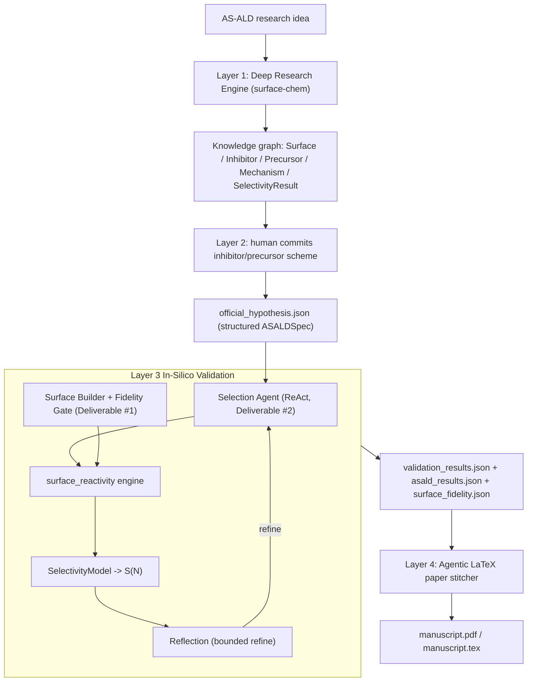

> **Running on Hugging Face:** this Space wraps the pipeline in a Gradio UI. Default is
> Tier-0 (CPU, free `cpu-basic` hardware) in offline/mock mode — no key needed. Uncheck
> offline and paste a Gemini AI Studio key for a real-LLM run. Tick **Tier-1** to use the
> foundation-MLIP (MACE) reactivity engine; for that to be fast, upgrade the Space in
> **Settings → Hardware** to a GPU (billed per hour) — on CPU hardware Tier-1 still runs
> but slowly. The image ships CUDA-enabled torch, so GPU is used automatically when present.


# AS-ALD Co-Scientist — Layers 1–4

An autonomous in-silico co-scientist for **area-selective atomic layer deposition
(AS-ALD)**. It turns a surface-chemistry research idea into ranked, literature-grounded
intervention hypotheses, lets a human commit one inhibitor/precursor scheme, validates the
selectivity claim computationally on experiment-faithful amorphous surfaces, and then
autonomously stitches a reproducible LaTeX manuscript of the result.

Target problem (Merck KGaA 2026 Innovation Cup, Challenge 4): *passivate SiN, deposit
SiOₓ-on-SiOₓ at ≥90 % selectivity at 10 nm oxide (3D-NAND cell isolation).*



## The two graded deliverables

1. **Amorphous surface builder** (`surfaces/`, ADR-003) — crystalline-derived slabs with
   Kim et al. 2026 Table-1 passivation + geometric bridge anneal (`-O-` siloxane,
   `-NH-` imide), an explicit *target site density*, and a *fidelity gate* that rejects
   slabs outside the paper's measured bands (a-SiO₂ −OH ~4.5–7.5 nm⁻²; a-SiN −NH₂
   ~2.5–5.5 nm⁻²; crystalline references c-SiO₂ 9.57, c-Si₃N₄ 5.97). It generates an
   *ensemble* of N slabs per condition so selectivity is reported as a distribution, not a
   fragile point estimate. True melt-quench AIMD amorphous networks are **Phase 3**
   (opt-in future work; see below).
2. **Agentic inhibitor/precursor selection** (`validation/designer.py`, ADR-005) — a ReAct
   selection agent that retrieves candidates from the knowledge graph, ranks them against a
   human-editable [`selection_criteria.md`](selection_criteria.md), and feeds the chosen
   pair into the validation loop (which can refine to another pair via the Reflection agent).

## Compute tiers (runs on a laptop or Colab)

| Tier | Where | What runs |
| --- | --- | --- |
| **0** (default) | anywhere, no GPU (M4 Pro native) | fidelity gate + site-resolved blocking (Kim 2026 priors for DMATMS/ETS; legacy terminal curve for carboxylic acids) + `SelectivityModel` + verdict, using literature/xTB adsorption-energy priors from `selection_criteria.md` |
| **1** | Colab CUDA / CPU | real molecules (rdkit) on Table-1 passivated + bridge-annealed slabs (pymatgen); multi-site/orientation foundation-MLIP (`mace_mp(model="medium")`) adsorption search; optional `reaction_energetics` (ΔEr two-state endpoints) and NEB Ea when `COMPUTE_ACTIVATION_ENERGY=true` |
| **2** | optional | xTB / small-DFT spot-checks to anchor Tier-1; reported as a `calibration_vs_literature` validity flag |

Set the tier via `COMPUTE_TIER` (0/1/2). MACE energy differences require float64, which the
Apple **MPS** backend does not support, so on the M4 Pro the MLIP tier runs on CPU while
Tier-0 stays interactive; `MLIP_DEVICE=auto` resolves to CUDA on Colab.

### Realistic Tier-1 surfaces (Phase 1)

With the `structures` extra (`pip install -e ".[structures]"` -> rdkit + pymatgen), Tier-1
builds physically real inputs instead of toy grids:

- **Molecules**: inhibitor/precursor SMILES embedded in 3D (rdkit ETKDGv3 + MMFF); raw SMILES
  are also accepted (used by the Phase-2 proposer).
- **Slabs**: `SLAB_SOURCE=procedural` cuts an alpha-quartz (`SiO2`) or beta-Si3N4 (`SiN`) slab
  (`SLAB_MILLER`, `SLAB_SUPERCELL`), applies Kim Table-1 passivation (Si(OH)₂H / SiOH / OH /
  NH₂ / NH by dangling-bond count), then a geometric bridge anneal to form `-O-` and
  `-NH-` sites; per-site-type densities are checked against Kim et al. 2026 bands. Provenance
  (phase, Miller index, capping, bridge counts) is recorded.
- **Adsorption**: a multi-site x multi-orientation x multi-height search
  (`N_ADSORPTION_SITES`, `ADSORPTION_ROTATIONS`, `ADSORPTION_HEIGHTS`) returns the most stable
  dE and every sampled configuration, calibrated against the mined literature dE.

Run the full Tier-1 funnel on a Colab GPU:

```bash
pip install -e ".[openai,mlip,structures]"
MLIP_DEVICE=cuda COMPUTE_TIER=1 aicoscientist-validate --run-id demo --offline
```

On the M4 Pro use `MLIP_DEVICE=cpu` (float64 MACE is unsupported on MPS); keep
`SLAB_SUPERCELL=2,2` and small search counts for a smoke test. Caveats: MLIP adsorption
energies can differ ~0.1-0.4 eV from DFT and are only valid as differences within one
calculator, so they are always reported with a `calibration_vs_literature` delta + flag;
Phase-1 slabs are crystalline-derived + annealed (not melt-quench amorphous), and `SiN`
carries larger uncertainty than `SiO2`.

### Kim et al. 2026 site-resolved reactivity (Phase 2b)

Grounded in Kim et al., *Appl. Surf. Sci.* 730 (2026) (DOI
[10.1016/j.apsusc.2026.166294](https://doi.org/10.1016/j.apsusc.2026.166294)):

- **Seeded priors** (`seed_asald.py`): measured site densities, DMATMS/ETS activation
  energies (Ea), and reaction energies (ΔEr) per site type (−OH, −O−, −NH₂, −NH−).
- **Site-resolved blocking** (`selectivity_model.py`): blocking = Σ (site fraction ×
  reactivity), where reactivity requires exothermic ΔEr **and** (when known) Arrhenius
  kinetics over `DOSE_TIME_S`. Carboxylic-acid inhibitors keep the legacy terminal-site
  `blocking_coverage_from_dE` curve so the verified aniline → acetic acid funnel is unchanged.
- **Site-matched screening** (`designer.py`): precursors carry preferred reactive sites
  (e.g. BDEAS → −OH); inhibitors are scored by how well their site reactivity covers those
  preferences, on top of differential adsorption + volatility + removability.
- **Tier-1 `reaction_energetics`** (`mlip.py`): builds physisorption + chemisorption
  endpoints and returns ΔEr = E_chem − E_phys (Eq. 1); bridge sites and Ea default to mined
  literature priors unless `COMPUTE_ACTIVATION_ENERGY=true` enables NEB.

Caveats (from the paper): 0 K internal energies; entropic shift up to ~0.25 eV at 150 °C
(keep calibration delta + flag); procedural slabs approximate but are not true melt-quench
networks; MLIP ΔEr/Ea valid only as differences within one calculator.

### Innovation + calibration rigor (Phase 2)

- **xTB cross-check** (`pip install -e ".[xtb]"`, Tier ≥ 2): GFN2-xTB recomputes a subset of
  adsorption configs; a large MLIP-vs-xTB gap flags the calibration for review.
- **RSA steric coverage** (`USE_RSA_COVERAGE`, Tier ≥ 1): caps blocking coverage at the
  random-sequential-adsorption jamming limit for the inhibitor's footprint, so bulky
  molecules can't reach an unphysical full monolayer.
- **Novel-compound proposer** (`USE_INHIBITOR_PROPOSER=true`): a generative agent invents new
  inhibitor candidates as SMILES (LLM with a key, deterministic combinatorial fallback
  offline), which are merged into the ranked selection loop tagged `ai-proposed`. They are
  built with rdkit and validated on the real slabs; a novel compound is **never** reported
  `supported` on Tier-0 priors alone (capped at `partially_supported`, calibration flagged
  `review`) — it must clear the Tier-1 MLIP search on real surfaces.

Full Phase-2 innovation run on a Colab GPU:

```bash
pip install -e ".[openai,mlip,structures,xtb]"
MLIP_DEVICE=cuda COMPUTE_TIER=2 USE_INHIBITOR_PROPOSER=true \
  aicoscientist-validate --run-id demo   # add --offline for the keyless combinatorial proposer
```

### Screening funnel (Phase 3, default)

Layer 3 runs as a batch **screening campaign** rather than a single-candidate test
(`SCREENING_MODE=funnel`, the default; `single` restores the legacy one-candidate loop):

1. **Pool** (`SCREEN_POOL_SIZE`, 10–50, default 20): built-in library + KG-mined priors +
   manual `selection_criteria.md` + AI-proposed novel molecules to fill the pool.
2. **Tier-0 prior rank** over all N — honest (no committed-candidate pin, no fabricated
   default priors; unevidenced candidates are flagged `no-prior` and ranked below).
3. **MLIP batch screen** of the shortlist (`SCREEN_SHORTLIST_M`, default 8) on **shared,
   seed-identical gated slab ensembles** (`SCREEN_ENSEMBLE_N`, default 2) — every candidate
   is scored on the same surfaces, and slabs are built once per campaign, not per molecule.
   The committed hypothesis molecule is always screened, even if prior-ranked low.
4. **Top-k full-fidelity re-run** (`SCREEN_TOP_K`, default 3) at `SURFACE_ENSEMBLE_N`
   (xTB cross-check included at Tier ≥ 2).
5. **Recommendation agent**: an LLM writes the final judgement (winner, runners-up, risks,
   committed-hypothesis outcome) but can never override the computed ranking; a
   deterministic fallback runs offline. Reflection may re-run the winner with a larger
   ensemble, bounded by `MAX_VALIDATION_ITERS` — it never switches molecules.

Artifacts: `screening_results.json` (full campaign table), `recommendation.json`,
`screening/asald_<candidate>.json` (per-candidate rich results); `asald_results.json`
holds the winner. The Layer-4 manuscript gains a campaign table (`tab:screening`) and a
ranked-selectivity funnel figure (`fig:screening`) alongside the winner deep-dive.

```bash
SCREEN_POOL_SIZE=30 SCREEN_SHORTLIST_M=10 SCREEN_TOP_K=3 \
MLIP_DEVICE=cuda COMPUTE_TIER=1 aicoscientist-validate --run-id demo
```

## Setup

```bash
python3.12 -m venv .venv
source .venv/bin/activate
pip install -e ".[openai]"          # Tier-0 + Layer 4 figures
# LLM providers (install the one you use):
#   pip install -e ".[anthropic]"        # Claude
#   pip install -e ".[google-genai]"     # Gemini via AI Studio API key
#   pip install -e ".[google-vertexai]"  # Gemini via Vertex AI (GCP)
# Optional Tier-1 (foundation MLIP): pip install -e ".[mlip]"
# Optional realistic structures (rdkit molecules + pymatgen slabs): pip install -e ".[structures]"
# Optional Tier-2 (xTB calibration): pip install -e ".[xtb]"
cp .env.example .env                # then set your LLM provider + key (optional; --offline works keyless)
```

The LLM is provider-agnostic via langchain's `init_chat_model` (`LLM_PROVIDER`/`LLM_MODEL`).
Supported providers include `openai`, `anthropic`, `ollama`, and Google Gemini both via
AI Studio API keys (`google_genai`, set `GOOGLE_API_KEY`) and via Vertex AI
(`google_vertexai`, set `GOOGLE_CLOUD_PROJECT`/`GOOGLE_CLOUD_LOCATION` with ADC or a
service-account JSON in `GOOGLE_APPLICATION_CREDENTIALS`). Every stage has a deterministic
offline fallback, so the full funnel runs with no key.

## Usage

```bash
# Layers 1-2: literature research + human hypothesis commitment
aicoscientist --idea "passivate a-SiN, grow SiOx-on-a-SiO2 to 90% selectivity at 10 nm" \
              --offline --run-id demo --auto select:1

# Layer 3: in-silico surface-reactivity validation (Tier-0 by default)
aicoscientist-validate --run-id demo --offline

# Layer 4: stitch the reproducible manuscript
aicoscientist-paper --run-id demo
```

Interactive Layer 2 actions: `select <n>`, `modify <n>`, `merge <n,m>`, `new`, `quit`.
For Tier-1 reactivity: `COMPUTE_TIER=1 aicoscientist-validate --run-id demo`.

## In-silico testing protocol (ADR-009)

For the committed hypothesis the `surface_reactivity` engine records every intermediate to
`asald_results.json`:

1. **Build & gate surfaces** — N a-SiO₂ (GS) and N a-SiN (NGS) slabs; discard gate failures.
2. **Inhibitor adsorption screen** — `dE_ads = E(slab+mol) − E(slab) − E(mol_gas)` on GS vs
   NGS (chemisorb on NGS ≲ −0.7 eV, physisorb on GS ≳ −0.3 eV).
3. **Effective blocking coverage** — site-resolved (Kim 2026) or terminal-site legacy
   blocking; only chemisorbed, purge-surviving inhibitor blocks the precursor; the
   differential `θ_block(NGS) − θ_block(GS)` drives selectivity. Per-site ΔEr/Ea are stored
   in `asald_results.json` under `site_resolved`.
4. **[Tier-2, optional] precursor barrier** — NEB lower bound, calibrated vs literature DFT.
5. **Selectivity & verdict** — differential blocking → nucleation delay → `S(N)`, reported as
   mean ± std at the target thickness with a supported / partially-supported / rejected verdict.

The verified worked example (carboxylic-acid SMI on a-SiN, BDEAS on a-SiO₂) yields
differential blocking ≈ 0.94 and **S ≈ 0.92 at 10 nm → supported**.

## Output artifacts (`artifacts/<run_id>/`)

Layers 1–2: `knowledge_graph.json`/`.graphml`, `citation_repository.json` (real DOIs),
`hypothesis_state_graphs.json`, `research_provenance.json`, `confidence_scores.json`,
`official_hypothesis.json` (with the structured `ASALDSpec`).

Layer 3: `validation_plan.json`, `validation_results.json`, `asald_results.json` (the
paper-ready protocol output), `surface_fidelity.json`, `simulation_logs/`, updated KG with
`validation_result:*` nodes.

Layer 4: `manuscript/manuscript.tex` (+ `manuscript.pdf` when a TeX toolchain is present)
and `manuscript/selectivity.png`. Every number and citation is pulled from the artifacts —
nothing is invented.

## Reproducibility (ADR-008)

Seeds, engine/tier, MLIP model + device, temperature, ensemble size, and surface-generation
parameters are logged into `asald_results.json` / `surface_fidelity.json`. A CPU
[`Dockerfile`](Dockerfile) and a locked [`environment.yml`](environment.yml) reproduce the
Tier-0 funnel end-to-end (`docker build -t asald . && docker run --rm asald`).

## Project layout

```
src/aicoscientist/
  config.py              # env-driven settings (incl. MLIP tier/model/device)
  models.py              # pydantic artifacts (incl. ASALDSpec, SurfaceFidelityReport)
  asald.py               # derive ASALDSpec from a committed hypothesis
  knowledge_graph.py     # networkx KG: provenance, merge, dedup
  sources/               # arxiv/openalex/crossref/pubmed/semantic_scholar + seed_asald + mock
  agents/                # orchestrator, research_agent, hypothesis_agent (surface-chem)
  surfaces/              # Deliverable #1: amorphous_builder, fidelity_gate, descriptors
  validation/            # Layer 3
    designer.py          # Deliverable #2: ReAct inhibitor/precursor selection agent
    reflection.py        # bounded closed-loop refinement
    surface_reactivity.py# ADR-004/009 protocol engine
    selectivity_model.py # ADR-006 nucleation-delay -> S(N)
    mlip.py              # Tier-1 foundation-MLIP hooks (ASE/MACE)
    registry.py / runner.py
  layer4_paper/          # ADR-007: template.tex, sections, figures, compiler, stitcher
  layer1_graph.py / layer2_graph.py / layer3_graph.py / graph.py
  cli.py / cli_validate.py / cli_paper.py
selection_criteria.md    # human-editable selection criteria + candidate library
```

## Phase 3 (opt-in future work): melt-quench AIMD amorphous surfaces

Kim et al. 2026 generate true amorphous SiO₂/SiN networks via melt-quench AIMD before
cleaving and saturating. The current pipeline uses faster crystalline-derived slabs +
Table-1 passivation + bridge anneal as a procedural approximation. A future opt-in
`SLAB_SOURCE=aimd` path would follow the paper's melt-quench protocol when AIMD-capable
calculators are available; until then, per-site DFT priors from the paper ground Tier-0/Tier-1
reactivity while the slab geometry remains approximate.

## Methodology references

Kim et al., Appl. Surf. Sci. 730 (2026) (amorphous AS-ALD screening, site-resolved ΔEr/Ea) ·
Parsons & Clark, Chem. Mater. 2020 (ASD review) · Tezsevin et al., Langmuir 2023 (aniline
SMI) · MSA inhibitor, Chem. Mater. 2024 · dehydroxylated silica slabs, PCCP 2025 · MLIP
barrier underestimation, arXiv:2502.15582 · Seal et al., arXiv:2510.27130 (Supervisor /
Swarm / ReAct / Reflection).
