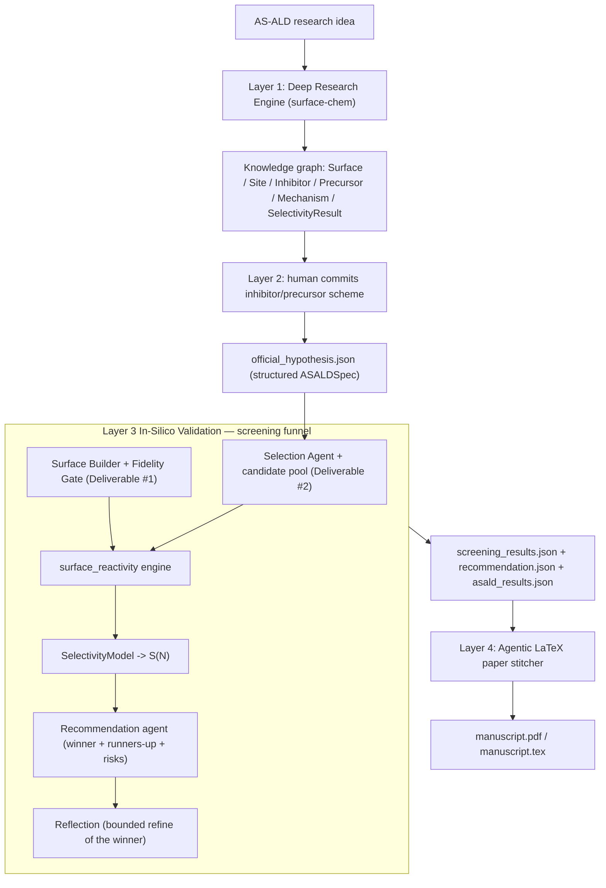

# AS-ALD Co-Scientist

An autonomous **in-silico AI co-scientist for area-selective atomic layer deposition
(AS-ALD)**. It turns a surface-chemistry research idea into ranked, literature-grounded
intervention hypotheses, lets a human commit one inhibitor/precursor scheme, **screens a
batch of candidate inhibitors** computationally on experiment-faithful amorphous surfaces,
recommends a winner, and then autonomously stitches a reproducible LaTeX manuscript of the
result.

> **Running on Hugging Face:** this Space wraps the pipeline in a Gradio UI. Default is
> Tier-0 (CPU, free `cpu-basic` hardware) in offline/mock mode — no key needed. Uncheck
> offline and paste a Gemini AI Studio key for a real-LLM run. Tick **Tier-1** to use the
> foundation-MLIP (MACE) reactivity engine; for that to be fast, upgrade the Space in
> **Settings → Hardware** to a GPU (billed per hour) — on CPU hardware Tier-1 still runs
> but slowly. The image ships CUDA-enabled torch, so GPU is used automatically when present.
>
> **Long runs are refresh-proof.** The pipeline executes in a detached background thread
> on the Space; a browser refresh, dropped WebSocket, or proxy hiccup only interrupts the
> log *stream*, never the run — paste the run id into **Reattach to run** to resume
> watching (runs may execute for up to 24 h). Set **Settings → Sleep time** to *Never*
> (or longer than your run) — HF puts the whole container to sleep after the idle
> window, killing any run with it; code cannot prevent that.
>
> **Persistent storage (recommended):** add it under **Settings → Storage** (smallest
> tier is plenty). The app auto-detects the `/data` mount and switches to it — run
> artifacts land in `/data/artifacts` and the MACE/torch model caches in `/data/.cache`,
> so results survive restarts and model weights download only once. Without storage the
> app falls back to the container filesystem and every restart wipes it (each run's log
> header tells you which mode you're in).

---

## 1 · The problem

### Challenge 4 — the goal

> **Passivate SiN (nitride) to deposit SiOₓ on SiOₓ (oxide) with 90 % selectivity at 10 nm
> of oxide thickness.** *(Merck KGaA 2026 Innovation Cup, Challenge 4 — 3D-NAND cell
> isolation.)*

The brief asks for an in-silico AI co-scientist with two graded deliverables:

1. **An amorphous surface builder** that better reflects experimental surfaces (SiOₓ models
   over-count reactive sites; SiNₓ –NH₂/–NH sites have irregular spacing).
2. **Agentic selection logic** for inhibitor/precursor candidates, grounded in literature and
   steerable via a supplemental criteria file.

Selectivity metric: **`S = (Thk_GS − Thk_NGS) / (Thk_GS + Thk_NGS)`**, evaluated where the
growth-surface film reaches 10 nm.

### Why area-selective ALD — and why it is hard

AS-ALD deposits film only where wanted: an inhibitor **chemisorbs on the non-growth surface
(NGS)** and survives the purge, so the precursor nucleates only on the **growth surface (GS)**.
The nucleation delay on the NGS *is* the selectivity. In 3D-NAND, growing oxide-on-oxide
isolates charge-trap nitride on adjacent cells to reduce cross-talk, with fewer patterning
and etch steps.

The central difficulty — and the challenge's stated risk — is that **computed selectivity is
dominated by the assumed amorphous-surface model**. Amorphous surfaces expose *terminal* and
*bridge* sites and carry ~35 % fewer terminal sites than crystalline references; a screening
tool built on crystalline slabs gets the *sign* of selectivity decisions wrong. Getting the
surface right is where the challenge is won or lost.

---

## 2 · The approach

### A four-layer agentic funnel



| Layer | What it does |
| --- | --- |
| **1 · Deep Research Engine** | A literature-mining swarm builds a typed knowledge graph of surfaces, sites, inhibitors, precursors, mechanisms, and prior selectivity results. |
| **2 · Human-in-the-loop** | The researcher reviews ranked intervention hypotheses and commits one inhibitor/precursor scheme — the expensive branch point. |
| **3 · In-silico validation & screening** | Surface builder + fidelity gate, agentic candidate selection, tiered reactivity engine, screening funnel, recommendation agent, and a bounded reflection loop. |
| **4 · Autonomous manuscript** | A section-writer swarm stitches a reproducible LaTeX paper — every number and figure pulled from the run artifacts, nothing invented. |

### The two graded deliverables

1. **Amorphous surface builder** (`surfaces/`) — crystalline-derived slabs with
   Table-1 passivation + a geometric bridge anneal (`-O-` siloxane, `-NH-` imide), an
   explicit *target site density*, and a *fidelity gate* that rejects slabs outside the
   measured acceptance bands. It generates an *ensemble* of N slabs per condition so
   selectivity is reported as a distribution, not a fragile point estimate.
2. **Agentic inhibitor/precursor selection** (`validation/designer.py`, 5) — a ReAct
   selection agent that assembles a candidate pool from the knowledge graph, ranks it against
   a human-editable [`selection_criteria.md`](selection_criteria.md), and feeds candidates
   into the screening funnel. A generative proposer can inject novel candidates that can
   never be reported "supported" on priors alone.

---

## 3 · The science

### Layer 1 — Deep Research Engine

A swarm mines open scholarly sources by DOI and normalizes everything to one citation schema,
populating a typed, *site-resolved* knowledge graph: `Surface{material, phase, site_type,
density}`, `Inhibitor`, `Precursor`, `Mechanism{site_type, ΔEr, Ea, byproduct}`,
`SelectivityResult`. A curated seed of real-DOI anchors guarantees no run is left without
domain-grounded literature; mined papers merge on top.

**Why the knowledge graph is the backbone.** The graph is not a bibliography — it is the
system's memory and the single source of truth that binds *literature → hypothesis → surface
→ site-resolved reactivity → selectivity → manuscript*. It earns its place for four reasons:

- **It dissolves the domain gap.** We do not personally hold deep AS-ALD surface chemistry;
  the graph lets the *system* learn the field. Typed, site-resolved nodes (silanol –OH,
  siloxane –O–, amine –NH₂, imide –NH–, each with its own ΔEr/Ea and byproduct) mean the
  hard chemistry is captured as structured facts an agent can reason over, not prose.
- **It is the candidate library and the prior store.** The selection agent draws its
  inhibitor/precursor pool from the graph, and the Tier-0 reactivity engine reads per-site
  energetics priors off the same nodes — so screening decisions rest on literature-grounded
  numbers with a traceable source, not model guesswork.
- **It makes every claim auditable.** Because each fact is a node with a DOI and each result
  links back in as a `validation_result:*` node joined by `evidence_for` edges, every number
  in the final paper resolves to either a logged computation or a cited source. That
  provenance chain is what separates a credible in-silico result from a number generator.
- **It is persistent, mergeable, and deduplicated.** New mined literature merges on top of the
  seeded anchors (with conflict resolution and dedup), so the graph grows across runs and
  improves the priors available to future screens.

One graph, three consumers: hypothesis generation (Layer 2), the selection agent's candidate
library + priors (Layer 3), and the real-DOI bibliography (Layer 4).

### Layer 2 — Human-in-the-loop commitment

"Which inhibitor/precursor scheme do we commit compute to?" is the expensive branch point, so
a human gate sits before the validation spend. The researcher selects, edits, merges, or
redirects the top hypotheses; the decision is saved as a structured `ASALDSpec` (GS/NGS,
inhibitor, precursor, target film, thickness, selectivity threshold, provenance) that seeds
the builder, the selection agent, the scoring model, and the manuscript.

### Deliverable 1 — Amorphous surface builder + fidelity gate

`seed bulk → cleave + vacuum → passivate sites → bridge anneal → fidelity gate → ensemble of
N`. The gate is the load-bearing rigor element: pathological surfaces are thrown out **before**
any expensive reactivity call. Per-site-type acceptance bands (nm⁻²):

| Surface | Site | Acceptance band | Crystalline ref. |
| --- | --- | --- | --- |
| a-SiO₂ | –OH silanol | ~4.5 – 7.5 | 9.57 |
| a-SiO₂ | –O– siloxane bridge | ~2.0 – 6.0 | — |
| a-SiN | –NH₂ amine | ~2.5 – 5.5 | 5.97 |
| a-SiN | –NH– imide bridge | ~2.0 – 5.5 | — |

Emits `surface_fidelity.json` with the crystalline references recorded for contrast.

**Two builder modes, one gate.** The default `procedural` path (crystalline-derived +
passivation + geometric bridge anneal) is fast and passes the gate on CPU. An opt-in
`md-amorphous` path (`SLAB_SOURCE=md-amorphous`, Tier ≥ 1) runs a **real MLIP-driven
melt-quench MD** on the slab's mobile region — heat to ~3500 K, hold to disorder, quench on a
temperature ramp, relax to 0 K — producing a genuinely amorphized network rather than a
geometric approximation, then passivates and anneals bridges as before. It self-heals: an MD
blow-up degrades gracefully to the geometric amorphizer and then the toy slab. An **LLM
param-tuning agent** (`MQ_AUTOTUNE`) can iterate melt-T / quench-steps on a small cheap probe
slab, scoring each trial by the fidelity gate + Si-coordination quality until it converges,
then reuses the tuned parameters for the full ensemble (deterministic heuristic fallback
offline). Both modes feed the *same* fidelity gate and ensemble machinery.

### Deliverable 2 — Site-matched selection (not strongest-binder)

A good inhibitor must passivate the *specific sites the precursor attacks* on the NGS —
ranking on raw binding strength selects the wrong pair. Precursors carry preferred reactive
sites (e.g. BDEAS → –OH); inhibitors are scored by how completely their exothermic,
kinetically-open site reactivity covers those preferences on the NGS **while staying inert on
the GS**. Ranking axes:

- Differential adsorption (chemisorb NGS / physisorb GS)
- Site-match to the precursor's preferred sites
- Volatility (dosable from vapor) · removability after growth · steric blocking footprint
- Literature grounding in the knowledge graph

Ranking is **honest**: the committed molecule is not auto-promoted; every candidate competes,
and candidates with no energetics evidence are flagged and ranked below evidenced ones.

### The in-silico testing protocol

For each candidate the `surface_reactivity` engine records every intermediate to
`asald_results.json`:

1. **Build & gate surfaces** — N a-SiO₂ (GS) and N a-SiN (NGS) slabs; discard gate failures.
2. **Site-resolved reactivity screen** — per-site reaction energy `ΔEr` (and barrier `Ea`
   where available) for the inhibitor on each surface; adsorption `dE_ads = E(slab+mol) −
   E(slab) − E(mol_gas)` (chemisorb on NGS ≲ −0.7 eV, physisorb on GS ≳ −0.3 eV).
3. **Effective blocking coverage** — blocking = Σ (site fraction × reactivity), counting only
   chemisorbed, purge-surviving inhibitor. The **differential blocking**
   `θ_block(NGS) − θ_block(GS)` is the selectivity driver — *not* raw Langmuir coverage, which
   saturates at process temperature and falsely washes out selectivity.
4. **[Tier-2, optional] precursor barrier** — NEB lower bound, calibrated vs literature DFT.
5. **Selectivity & verdict** — differential blocking → nucleation delay → `S(N)`, reported as
   mean ± std at 10 nm with a supported / partially-supported / rejected verdict and a
   calibration flag.

### Tiered compute (laptop or GPU)

| Tier | Where | What runs |
| --- | --- | --- |
| **0** (default) | anywhere, no GPU | fidelity gate + site-resolved blocking + `SelectivityModel` + verdict, using literature/xTB adsorption-energy priors |
| **1** | CUDA / CPU | real molecules (rdkit) on passivated + bridge-annealed slabs (pymatgen), optionally on **MLIP melt-quench MD-amorphized** slabs (`SLAB_SOURCE=md-amorphous`); multi-site/orientation foundation-MLIP (`mace_mp(model="medium")`, or `chgnet`) adsorption search; optional `reaction_energetics` (ΔEr endpoints) and NEB Ea when `COMPUTE_ACTIVATION_ENERGY=true` |
| **2** | optional | xTB spot-checks anchoring Tier-1, reported as a `calibration_vs_literature` validity flag |

Set the tier via `COMPUTE_TIER` (0/1/2). MACE energy differences require float64, which the
Apple **MPS** backend does not support, so on the M4 Pro the MLIP tier runs on CPU while
Tier-0 stays interactive; `MLIP_DEVICE=auto` resolves to CUDA when present. Discipline
throughout: foundation-model barriers are treated as **lower bounds**, and every energetics
value carries a predicted-vs-reference delta — never hidden.

---

## 4 · The screening funnel

Layer 3 runs as a batch **screening campaign** rather than a single-candidate test
(`SCREENING_MODE=funnel`, the default; `single` restores the legacy one-candidate loop):

1. **Pool** (`SCREEN_POOL_SIZE`, 10–50, default 40): built-in library + KG-mined priors +
   manual `selection_criteria.md` + AI-proposed novel molecules to fill the pool.
2. **Tier-0 prior rank** over all N — honest (no committed-candidate pin, no fabricated
   default priors; unevidenced candidates are flagged `no-prior` and ranked below).
3. **MLIP batch screen** of the shortlist (`SCREEN_SHORTLIST_M`, default 10) on **shared,
   seed-identical gated slab ensembles** (`SCREEN_ENSEMBLE_N`, default 2) — every candidate is
   scored on the same surfaces, and slabs are built once per campaign, not per molecule. The
   committed hypothesis molecule is always screened, even if prior-ranked low; a slice of the
   shortlist (`SCREEN_RESERVE_NOVEL_FRAC`, default ½) is reserved for AI-proposed molecules so
   novel candidates with no priors are not buried by the prior rank. Candidates can be screened
   concurrently on the shared slabs (`SCREEN_WORKERS`).
4. **Top-k full-fidelity re-run** (`SCREEN_TOP_K`, default 3) at `SURFACE_ENSEMBLE_N` (xTB
   cross-check included at Tier ≥ 2).
5. **Recommendation agent** writes the final judgement (winner, runners-up, risks,
   committed-hypothesis outcome); a deterministic fallback runs offline. Reflection may re-run
   the winner with a larger ensemble, bounded by `MAX_VALIDATION_ITERS` — it never switches
   molecules.

**Closed-loop generational design** (`SCREEN_GENERATIONS`, 1 = off). When a campaign fails to
clear the target, the results (which sites still leaked, which chemistries under-blocked) are
fed back to the novel-compound proposer, which designs a *new generation* of candidates and
re-screens — an evolutionary loop rather than a one-shot pool. An optional **AI experiment
planner** (`USE_AI_PLANNER`) lets the LLM decide, per iteration, *which* inhibitor to test and
at *what* compute tier (cheap Tier-0 screen vs. expensive real-MLIP Tier-1), grounded in the
deep-research context and prior reflections; it falls back to the deterministic rank-index +
global tier when disabled.

### What makes the campaign trustworthy

- **Apples-to-apples** — every candidate is scored on the *same* seed-identical gated slab
  ensembles; differences are chemistry, not surface luck. Slabs are built once per campaign.
- **Honest competition** — no candidate is auto-promoted; the recommendation states plainly
  whether the committed molecule won or lost, and to whom.
- **Evidence discipline** — extrapolated, missing, or AI-proposed priors are flagged and can
  never be reported "supported" on priors alone; a calibration delta rides every value.
- **The agent can't cheat physics** — the recommendation agent may narrate risk and context,
  but a guard forces the winner to be the top candidate by *computed* selectivity.

Artifacts: `screening_results.json` (full campaign table), `recommendation.json`,
`screening/asald_<candidate>.json` (per-candidate rich results); `asald_results.json` holds
the winner. The Layer-4 manuscript gains a campaign table (`tab:screening`) and a
ranked-selectivity funnel figure (`fig:screening`) alongside the winner deep-dive.

```bash
SCREEN_POOL_SIZE=30 SCREEN_SHORTLIST_M=10 SCREEN_TOP_K=3 \
MLIP_DEVICE=cuda COMPUTE_TIER=1 aicoscientist-validate --run-id demo
```

The novel-compound proposer (`USE_INHIBITOR_PROPOSER=true`) fills the pool with generative
SMILES candidates (LLM with a key, deterministic combinatorial fallback offline), built with
rdkit and tagged `ai-proposed`; the RSA steric-coverage cap (`USE_RSA_COVERAGE`, Tier ≥ 1)
prevents bulky molecules from reaching an unphysical full monolayer.

---

## 5 · Layer 4 — the co-scientist authors its own paper

A section-writer swarm fans out one agent per section (abstract, introduction, architecture,
methods, results, discussion, limitations, conclusion, reproducibility). Hard rules: **no
invented numbers** (every value grounded in the artifacts; absent values written as "not
recorded"), a **real bibliography** from the Layer-1 mined DOIs, and a **campaign-aware**
Results section that presents the whole screen (comparison table + ranked figure) before the
winner deep-dive. A deterministic offline path writes the full paper without a key.

---

## 6 · Results & rigor

### Example screening campaign

A keyless Tier-0 run over a 12-candidate pool (shortlist 5, top-2 re-run at full fidelity)
selects **acetic acid** (S ≈ 0.92 at 10 nm, differential blocking ≈ 0.94 → *supported*) over
the committed `aniline` (S ≈ 0.23 → *rejected*) — and says so honestly. These numbers are a
pipeline demonstration, not a quantitative claim; the manuscript labels them as such when the
calibration flag reads `review` or energies sit at the clamp bounds.

### How the system meets Challenge 4

| Challenge requirement | How the co-scientist delivers it |
| --- | --- |
| Amorphous surface builder that better reflects experiment | Site-density target + fidelity gate against measured bands; ensembles; no over-counted sites |
| Agentic inhibitor/precursor selection | ReAct selection agent + generative proposer, site-matched, steerable via a criteria file |
| 90 % selectivity at 10 nm oxide | Site-resolved blocking → nucleation delay → `S(N)` reported at 10 nm as mean ± std |
| In-silico testing with computed results | Five-step protocol emitting a full JSON record; batch campaign over 10–50 candidates |
| Reproducible, Python, easy to use | Pinned provenance, Docker, CLI + Gradio UI, deterministic offline mode |

### Reproducibility & provenance

Seeds, compute tier, MLIP model/device/dtype, slab source and supercell, temperature, dose
time, ensemble size, and package versions are all logged into `asald_results.json` /
`surface_fidelity.json` / the screening artifacts. Results link back into the knowledge graph
so every claim resolves to a logged computation and every prior to a source. A CPU
[`Dockerfile`](Dockerfile) and a locked [`environment.yml`](environment.yml) reproduce the
Tier-0 funnel end-to-end (`docker build -t asald . && docker run --rm asald`).

### Technology & agentic patterns

- **Orchestration** — LangGraph state machines; Supervisor + Swarm; ReAct designer; bounded Reflection loop; an AI experiment planner (which candidate, which tier); a closed-loop generational proposer; an LLM melt-quench param-tuner.
- **Atomistic engine** — ASE + foundation MLIP (MACE, CHGNet) with real MLIP melt-quench MD amorphization; rdkit molecules; pymatgen slabs; torch-dftd D3 dispersion; xTB cross-check.
- **Data & models** — typed knowledge graph; Pydantic schemas; scholarly source clients; provenance store.
- **Delivery** — CLI (three entry points); refresh-proof Gradio UI on a Hugging Face Space (detached background runs, reattach-after-disconnect, persistent storage); LaTeX manuscript stitcher (IEEEtran, tectonic/latexmk/pdflatex); Docker + locked env.

### Utilized Software

**LLMs & orchestration**
- **LLMs** — provider-agnostic via LangChain's `init_chat_model`; supports **OpenAI (GPT)**, **Anthropic (Claude)**, and **Google Gemini** (both AI Studio API-key and Vertex AI routes). The provider/model is a runtime config switch (`LLM_PROVIDER`/`LLM_MODEL`), not hardcoded — we ran with Gemini during development. Every stage has a deterministic, keyless offline fallback, so the pipeline is fully reproducible without any LLM.
- **LangGraph** — state-machine orchestration across all four layers: a Supervisor + Swarm pattern for the literature-mining agents, a ReAct-style designer for the surface/inhibitor selection agent, a bounded Reflection loop that closes the validation cycle, and additional agentic loops — an AI experiment planner (chooses which candidate and which compute tier per iteration), a closed-loop generational proposer (evolves new candidates after a failed campaign), and an LLM param-tuner for the melt-quench surface builder.
- **LangChain** — model abstraction, structured-output parsing, and the scholarly source clients.

**Atomistic / scientific computing**
- **ASE** (Atomic Simulation Environment) — slab construction, adsorption geometry search, MLIP molecular-dynamics melt-quench, structure I/O.
- **MACE** (`mace-torch`) — the foundation machine-learning interatomic potential (MLIP) used for Tier-1 adsorption-energy calculations *and* the real melt-quench MD amorphization of the slabs; **CHGNet** and **torch-dftd** (D3 dispersion) as alternate/supplementary MLIP backends; **PyTorch** as the compute backend (CPU/CUDA).
- **RDKit** — builds real 3D inhibitor/precursor molecules from SMILES (ETKDGv3 embedding + MMFF).
- **pymatgen** — generates the crystalline-derived amorphous slabs (α-quartz SiO₂, β-Si₃N₄).
- **tblite** (GFN2-xTB) — semi-empirical Tier-2 spot-checks that calibrate the MLIP energies against a cheaper independent method.

**Data, knowledge graph & delivery**
- **NetworkX** — the typed knowledge graph (surfaces, inhibitors, precursors, mechanisms, citations) that Layer 1 builds and every later layer queries.
- **Pydantic** — schema validation across every inter-layer JSON artifact, so hand-offs between layers are typed and self-checking.
- **httpx** — clients for the scholarly literature sources (arXiv, OpenAlex, Crossref, PubMed, Semantic Scholar) that ground every hypothesis in real, DOI-cited literature.
- **Matplotlib** — the figure suite (selectivity curves, growth curves, adsorption-energy bars, site-density bars, and rendered atomic-model slab/molecule views).
- **LaTeX** (IEEEtran class, compiled via `tectonic`/`latexmk`/`pdflatex`) — the autonomously authored manuscript.
- **Gradio** on a **Hugging Face Space** — the interactive front-end over the CLI pipeline: long runs execute in a detached background thread (refresh-/disconnect-proof, reattach by run id), with auto-detected persistent storage for artifacts and MACE/torch caches.
- **Docker** + a locked `environment.yml`/`requirements.txt` — pinned, reproducible environment.

**Techniques**
- A **four-layer agentic funnel**: literature-grounded hypothesis generation → human-in-the-loop commitment → tiered in-silico validation → autonomous manuscript authoring.
- **Fidelity-gated amorphous surface generation** — slabs are rejected outright if their per-site-type densities fall outside published (Kim et al. 2026) experimental bands, before any expensive reactivity compute is spent. A high-fidelity opt-in path amorphizes the slab with a **real foundation-MLIP melt-quench MD** (heat → disorder → quench → relax), auto-tuned by an LLM agent against the same gate.
- **Site-matched (not strongest-binder) inhibitor screening** — a three-step protocol scoring candidates by how well they passivate the precursor's actual reactive sites.
- **Tiered compute with literature calibration** — cheap Tier-0 literature-prior screens promoted to real Tier-1 MLIP calculations (and optional Tier-2 xTB cross-checks) only for promising/committed candidates, with every predicted energy compared against a literature anchor and flagged if it diverges.
- **Bounded Reflection loop** — a closed-loop refine/accept cycle with a fixed iteration budget, so the agent can revise a rejected hypothesis without running indefinitely.
- **Closed-loop generational design** — after a failed campaign the results are fed back to the novel-compound proposer, which designs and re-screens a fresh generation of candidates (an evolutionary search), optionally steered by an AI planner that picks the candidate and compute tier each round.
- **A LangGraph swarm of section-writer agents** authors the IEEE-format manuscript itself: each section is drafted in parallel, grounded strictly in the run's own JSON artifacts (no invented numbers), with deterministic fallbacks if the LLM output fails validation.

---

## Setup

```bash
python3.12 -m venv .venv
source .venv/bin/activate
pip install -e ".[openai]"          # Tier-0 + Layer 4 figures
# LLM providers (install the one you use):
#   pip install -e ".[anthropic]"        # Claude
#   pip install -e ".[google-genai]"     # Gemini via AI Studio API key
#   pip install -e ".[google-vertexai]"  # Gemini via Vertex AI (GCP)
# Optional Tier-1 (foundation MLIP): pip install -e ".[mlip]"
# Optional realistic structures (rdkit molecules + pymatgen slabs): pip install -e ".[structures]"
# Optional Tier-2 (xTB calibration): pip install -e ".[xtb]"
cp .env.example .env                # then set your LLM provider + key (optional; --offline works keyless)
```

The LLM is provider-agnostic via langchain's `init_chat_model` (`LLM_PROVIDER`/`LLM_MODEL`).
Supported providers include `openai`, `anthropic`, `ollama`, and Google Gemini both via
AI Studio API keys (`google_genai`, set `GOOGLE_API_KEY`) and via Vertex AI
(`google_vertexai`, set `GOOGLE_CLOUD_PROJECT`/`GOOGLE_CLOUD_LOCATION` with ADC or a
service-account JSON in `GOOGLE_APPLICATION_CREDENTIALS`). Every stage has a deterministic
offline fallback, so the full funnel runs with no key.

## Usage

```bash
# Layers 1-2: literature research + human hypothesis commitment
aicoscientist --idea "passivate a-SiN, grow SiOx-on-a-SiO2 to 90% selectivity at 10 nm" \
              --offline --run-id demo --auto select:1

# Layer 3: in-silico screening funnel (Tier-0 by default)
aicoscientist-validate --run-id demo --offline

# Layer 4: stitch the reproducible manuscript
aicoscientist-paper --run-id demo
```

Interactive Layer 2 actions: `select <n>`, `modify <n>`, `merge <n,m>`, `new`, `quit`.
For a Tier-1 GPU screen: `MLIP_DEVICE=cuda COMPUTE_TIER=1 aicoscientist-validate --run-id demo`.

## Output artifacts (`artifacts/<run_id>/`)

Layers 1–2: `knowledge_graph.json`/`.graphml`, `citation_repository.json` (real DOIs),
`hypothesis_state_graphs.json`, `research_provenance.json`, `confidence_scores.json`,
`official_hypothesis.json` (with the structured `ASALDSpec`).

Layer 3: `screening_results.json` (campaign table), `recommendation.json`,
`screening/asald_<candidate>.json`, `validation_plan.json`, `validation_results.json`,
`asald_results.json` (paper-ready winner output), `surface_fidelity.json`, `simulation_logs/`,
updated KG with `validation_result:*` nodes.

Layer 4: `manuscript/manuscript.tex` (+ `manuscript.pdf` when a TeX toolchain is present) and
its figures (`screening.png`, `selectivity.png`, `energetics.png`, `slabs.png`, …). Every
number and citation is pulled from the artifacts — nothing is invented.

## Project layout

```
src/aicoscientist/
  config.py              # env-driven settings (MLIP tier/model/device, screening funnel)
  models.py              # pydantic artifacts (incl. ASALDSpec, SurfaceFidelityReport)
  asald.py               # derive ASALDSpec from a committed hypothesis
  knowledge_graph.py     # networkx KG: provenance, merge, dedup
  sources/               # arxiv/openalex/crossref/pubmed/semantic_scholar + seed_asald + mock
  agents/                # orchestrator, research/hypothesis agents, inhibitor_proposer, recommender
  surfaces/              # Deliverable #1: amorphous_builder (procedural + MLIP melt-quench),
                         #   fidelity_gate, descriptors, param_tuner (LLM melt-quench autotuner)
  validation/            # Layer 3
    designer.py          # Deliverable #2: ReAct selection agent + candidate pool
    screening.py         # screening-funnel campaign orchestrator (+ generational loop)
    reflection.py        # bounded closed-loop refinement
    surface_reactivity.py#  protocol engine
    selectivity_model.py #  nucleation-delay -> S(N)
    mlip.py              # Tier-1 foundation-MLIP hooks (ASE/MACE/CHGNet)
    registry.py / runner.py
  layer4_paper/          # 7: template.tex, sections, figures, compiler, stitcher
  layer1_graph.py / layer2_graph.py / layer3_graph.py / graph.py
  cli.py / cli_validate.py / cli_paper.py
app.py                   # Gradio UI over the CLI pipeline (Hugging Face Space entry point)
selection_criteria.md    # human-editable selection criteria + candidate library
```

## Slab fidelity: procedural → MLIP melt-quench → AIMD

Three levels of surface realism, each declared in provenance:

- **`procedural`** (default, any tier) — crystalline-derived slab + Table-1 passivation +
  geometric bridge anneal. Fast, CPU-friendly, passes the fidelity gate; the slab *geometry* is
  an approximation but per-site DFT priors ground the reactivity.
- **`md-amorphous`** (opt-in, Tier ≥ 1) — **now implemented**: a real foundation-MLIP (MACE)
  melt-quench MD disorders the slab before passivation, with an optional LLM param-tuning agent
  (`MQ_AUTOTUNE`) that searches melt-T / quench-steps against the fidelity gate. This is a
  genuinely amorphized network, not a geometric knob, and runs on a GPU (or slowly on CPU).
- **AIMD-quality melt-quench** (future work) — replacing the MLIP quench with a DFT/AIMD
  calculator for reference-grade networks, when such calculators are affordable in-loop. Until
  then the `md-amorphous` path is the high-fidelity option and per-site DFT priors anchor the
  energetics.

---

## References

Kept off the narrative above by design; these ground the system's science and architecture.

### Domain literature

- Kim, Kim, Hahm, Kwon, Park, Hong & Han. *A computational study for screening high-selectivity
  inhibitors in area-selective ALD on amorphous surfaces.* Appl. Surf. Sci. **730** (2026)
  166294. [10.1016/j.apsusc.2026.166294](https://doi.org/10.1016/j.apsusc.2026.166294) —
  anchor methodology (slab protocol, measured site densities, site-resolved ΔEr/Ea, three-step
  screening).
- Parsons & Clark. *Area-selective deposition: fundamentals, applications, and future outlook.*
  Chem. Mater. 2020. [10.1021/acs.chemmater.0c00722](https://doi.org/10.1021/acs.chemmater.0c00722)
- Mameli & Teplyakov. *Selection criteria for small-molecule inhibitors in area-selective ALD.*
  Acc. Chem. Res. 2023. [10.1021/acs.accounts.3c00221](https://doi.org/10.1021/acs.accounts.3c00221)
- Soethoudt et al. *Selective surface reactions of dimethylamino-trimethylsilane for
  area-selective deposition.* J. Phys. Chem. C 2020. [10.1021/acs.jpcc.9b11270](https://doi.org/10.1021/acs.jpcc.9b11270)
- Merkx et al. *Relation between reactive surface sites and precursor choice for AS-ALD using
  small-molecule inhibitors.* J. Phys. Chem. C 2022. [10.1021/acs.jpcc.1c10816](https://doi.org/10.1021/acs.jpcc.1c10816)
- Tezsevin et al. *Computational investigation of precursor blocking with an aniline SMI.*
  Langmuir 2023. [10.1021/acs.langmuir.2c03214](https://doi.org/10.1021/acs.langmuir.2c03214)
- Karasulu, Roozeboom & Mameli. *High-throughput area-selective spatial ALD of SiO₂ with
  interleaved small-molecule inhibitors.* Adv. Mater. 2023. [10.1002/adma.202301204](https://doi.org/10.1002/adma.202301204)
- Zhuravlev. *The surface chemistry of amorphous silica.* Colloids Surf. A 2000.
  [10.1016/s0927-7757(00)00556-2](https://doi.org/10.1016/s0927-7757(00)00556-2)

### Methods & agentic architecture

- Ewing et al. *Accurate amorphous silica surface models from first-principles thermodynamics
  of surface dehydroxylation.* Langmuir 2014. [10.1021/la500422p](https://doi.org/10.1021/la500422p)
- *MAD-SURF: fine-tuning MACE-MPA-0 for molecular adsorption on surfaces.* arXiv:2601.18852 —
  Tier-1 engine basis.
- *Fine-tuning foundation MLIPs with frozen transfer learning.* arXiv:2502.15582 — foundation
  MLIPs underestimate reaction barriers (the Ea lower-bound rule).
- Werbrouck et al. *LLM Agents for Knowledge Discovery in Atomic Layer Processing.*
  arXiv:2509.26201 — agent/swarm exploration and persistence.
- Ghafarollahi & Buehler. *SparksMatter.* arXiv:2508.02956 — ideation → planning →
  experimentation → reporting.
- Gottweis et al. *Towards an AI Co-Scientist.* arXiv:2502.18864 — co-scientist framing.
- Lu et al. *The AI Scientist.* arXiv:2408.06292 (Nature, 2026) — autonomous LaTeX authoring +
  figure QA + automated review.
- *PaperOrchestra: multi-agent LaTeX manuscript assembly.* arXiv:2604.05018
- Seal et al. arXiv:2510.27130 — the Supervisor / Swarm / ReAct / Reflection architecture used
  in Layer 3.
