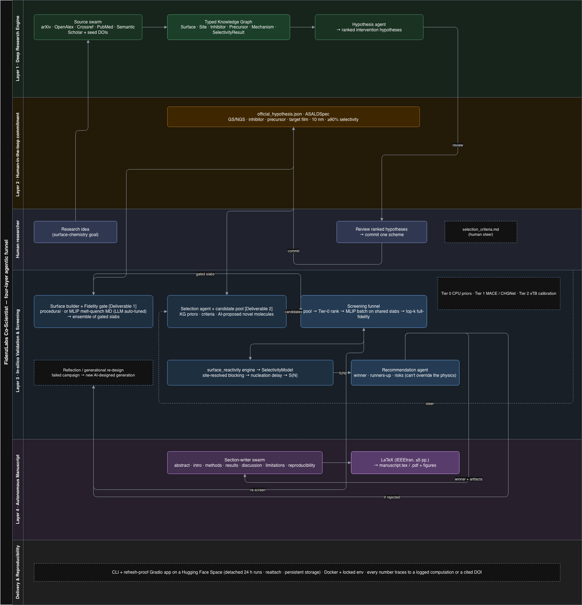

### Utilized Software

**LLMs & orchestration**
- **LLMs** — provider-agnostic via LangChain supports **OpenAI (GPT)**, **Anthropic (Claude)**, and **Google Gemini** (both AI Studio API-key and Vertex AI routes). The provider/model is a runtime config switch (`LLM_PROVIDER`/`LLM_MODEL`), not hardcoded — we ran with Gemini during development. Every stage has a deterministic based on heuristics which is keyless offline fallback in case of retry LLM call failures, so the pipeline is fully reproducible without any LLM as well.
- **LangGraph** — state-machine orchestration across all four layers: a Supervisor + Swarm pattern for the literature-mining agents, a ReAct-style designer for the surface/inhibitor selection agent, and a bounded Reflection loop that closes the validation cycle.
- **LangChain** — model abstraction, structured-output parsing, and the scholarly source clients.

**Atomistic / scientific computing**
- **ASE** (Atomic Simulation Environment) — slab construction, adsorption geometry search, structure I/O.
- **MACE** (`mace-torch`) — the foundation machine-learning interatomic potential (MLIP) used for Tier-1 adsorption-energy calculations on real 3D slabs; **CHGNet** and **torch-dftd** (D3 dispersion) as alternate/supplementary MLIP backends; **PyTorch** as the compute backend (CPU/CUDA).
- **RDKit** — builds real 3D inhibitor/precursor molecules from SMILES (ETKDGv3 embedding + MMFF).
- **pymatgen** — generates the crystalline-derived amorphous slabs (SiO₂, Si₃N₄).
- **tblite** (GFN2-xTB) — semi-empirical Tier-2 spot-checks that calibrate the MLIP energies against a cheaper independent method.

**Data, knowledge graph & delivery**
- **NetworkX** — the typed knowledge graph (surfaces, inhibitors, precursors, mechanisms, citations) that Layer 1 builds and every later layer queries.
- **Pydantic** — schema validation across every inter-layer JSON artifact, so hand-offs between layers are typed and self-checking.
- **httpx** — clients for the scholarly literature sources (arXiv, OpenAlex, Crossref, PubMed, Semantic Scholar) that ground every hypothesis in real, DOI-cited literature.
- **Matplotlib** — the figure suite (selectivity curves, growth curves, adsorption-energy bars, site-density bars, and rendered atomic-model slab/molecule views).
- **LaTeX** (IEEEtran class, compiled via `tectonic`/`latexmk`/`pdflatex`) — the autonomously authored manuscript.
- **Docker**  — For Orchestration of the pipeline which is fully potable and reproducible 

**Techniques**

- A **four-layer agentic funnel**: literature-grounded hypothesis generation → human-in-the-loop commitment → tiered in-silico validation → autonomous manuscript authoring.
- **Fidelity-gated amorphous surface generation** — slabs are rejected outright if their per-site-type densities fall outside published (Kim et al. 2026) experimental bands, before any expensive reactivity compute is spent.
- **Site-matched (not strongest-binder) inhibitor screening** — a three-step protocol scoring candidates by how well they passivate the precursor's actual reactive sites.
- **Tiered compute with literature calibration** — cheap Tier-0 literature-prior screens promoted to real Tier-1 MLIP calculations (and optional Tier-2 xTB cross-checks) only for promising/committed candidates, with every predicted energy compared against a literature anchor and flagged if it diverges.
- **Bounded Reflection loop** — a closed-loop refine/accept cycle with a fixed iteration budget, so the agent can revise a rejected hypothesis without running indefinitely.
- **A LangGraph swarm of section-writer agents** authors the IEEE-format manuscript itself: each section is drafted in parallel, grounded strictly in the run's own JSON artifacts (no invented numbers), with deterministic fallbacks if the LLM output fails validation.